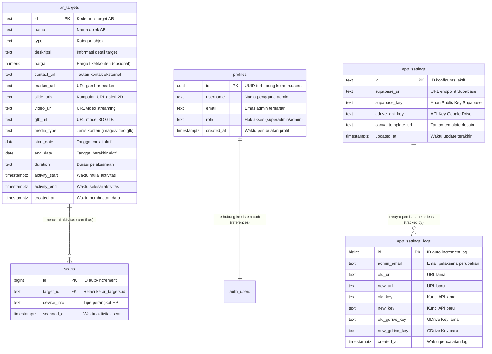
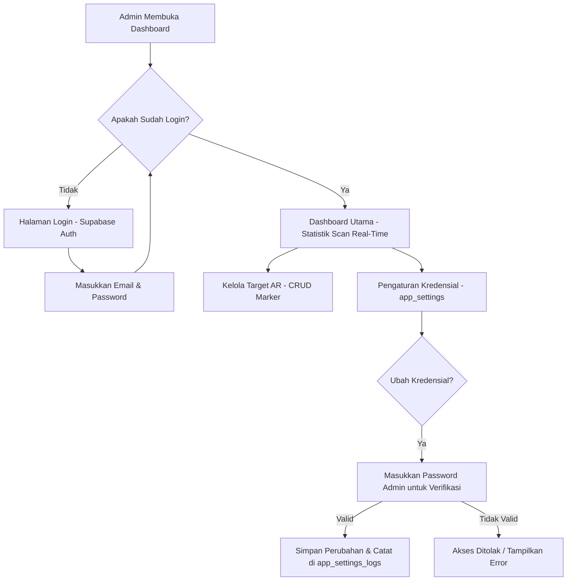
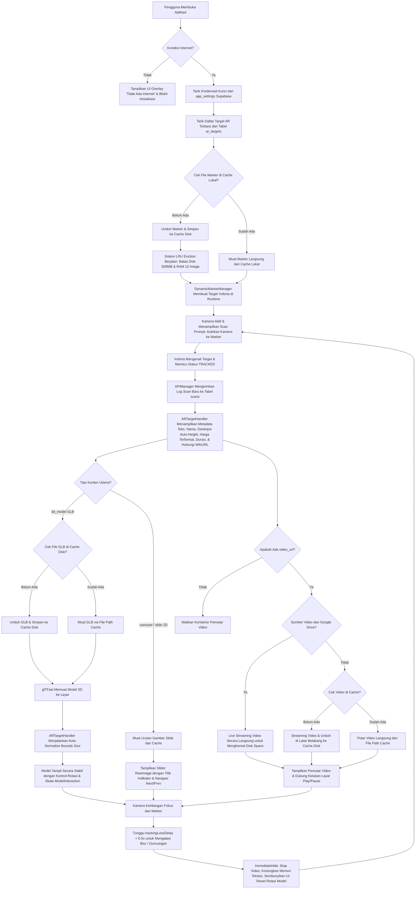

# Djaswita AR - Platform Manajemen App Augmented Reality

Proyek ini terdiri dari dua bagian utama:

1. **Unity AR Application (Unity 6 Core)**: Aplikasi mobile AR berbasis Unity untuk menampilkan konten AR dinamis di perangkat Android/iOS.
2. **Web Admin Dashboard**: Dashboard admin berbasis web untuk pengelolaan data marker secara real-time yang terhubung ke database Supabase.

---

## 1. Arsitektur & Rancangan Sistem (System Architecture & Design)

Djaswita AR dirancang dengan arsitektur modern yang memisahkan antara pengelola data (CMS/Web Admin), jembatan data & penyimpanan cloud (Supabase BaaS), serta penampil konten interaktif (Unity Client). Pemisahan ini memastikan sistem tetap ringan, mudah dirawat, dan hemat kuota data internet saat dijalankan di perangkat mobile pengguna.

### A. Cetak Biru Arsitektur (System Architecture Blueprint)

Sistem Djaswita AR terdiri dari tiga pilar utama yang saling terhubung secara real-time:

1. **Web Admin Dashboard (CMS)**:
   * **Teknologi**: HTML5, Vanilla JavaScript, CSS Premium, dan Vite.
   * **Peran**: Menjadi pusat kendali bagi pemilik platform. Admin dapat memantau data analitik scan, mengelola data target AR (tambah/edit/hapus), serta memperbarui konfigurasi API key secara aman tanpa perlu menyentuh kode program.
2. **Supabase (Backend-as-a-Service)**:
   * **Peran**: Sebagai pusat data tunggal (*Single Source of Truth*). Supabase menyediakan database relasional PostgreSQL untuk menyimpan tabel targets dan log analitik, mengelola autentikasi admin, serta menyediakan Cloud Storage untuk menyimpan aset 3D (GLB), gambar marker, dan file video.
3. **Unity Client App (Unity 6 Core)**:
   * **Teknologi**: Unity 6, Universal Render Pipeline (URP), Vuforia Engine (AR), dan glTFast (3D Loader).
   * **Peran**: Aplikasi mobile di tangan pengguna. Aplikasi ini mengunduh data marker dan model 3D secara dinamis di latar belakang, memindai brosur/marker cetak menggunakan kamera AR, dan merender objek 3D serta video interaktif secara presisi di layar ponsel.

---

### B. Struktur Basis Data Supabase (Database Schema)

Database kami menggunakan PostgreSQL yang dikonfigurasi secara efisien melalui Supabase. Berikut adalah diagram relasi entitas (Entity Relationship Diagram - ERD) yang menggambarkan bagaimana data saling terhubung, diikuti oleh penjelasan struktur dari masing-masing tabel:



*   **`ar_targets` (Tabel Utama Target AR)**: Menyimpan semua data konten AR yang akan dirender di perangkat mobile.
    *   `id`: Kode unik target (misal: `tangkuban-perahu`).
    *   `nama` & `type`: Nama target/objek AR dan kategorinya (edukasi, bisnis, hiburan, dll.).
    *   `deskripsi` & `harga`: Informasi detail untuk pengguna.
    *   `marker_url`, `glb_url`, `video_url`: Tautan publik file aset (gambar marker, model 3D, dan video panduan) yang disimpan di Storage Supabase atau Google Drive.
    *   `contact_url`: Tautan eksternal untuk kontak / WhatsApp / website detail.
*   **`scans` (Tabel Analitik / Engagement Tracking)**: Mencatat setiap kali pengguna memindai marker.
    *   `target_id`: Menghubungkan ke tabel `ar_targets`.
    *   `device_info`: Informasi tipe perangkat (Android/iOS) untuk analisis demografi teknis.
    *   `scanned_at`: Waktu presisi pemindaian dilakukan.
*   **`profiles` (Tabel Pengguna/Admin)**: Ekstensi dari sistem autentikasi Supabase untuk mengelola otorisasi akses dashboard.
    *   `id`: UUID yang terhubung langsung dengan `auth.users` Supabase.
    *   `username` & `email`: Identitas admin.
    *   `role`: Hak akses admin (misal: `admin`, `superadmin`).
*   **`app_settings` & `app_settings_logs` (Tabel Konfigurasi Global & Keamanan)**:
    *   `app_settings` menyimpan kredensial API aktif (URL Supabase, Anon Key, Google Drive API Key) agar dapat ditarik secara dinamis oleh aplikasi Unity.
    *   `app_settings_logs` mencatat riwayat perubahan kredensial API lengkap dengan email admin yang melakukan pembaruan untuk meminimalkan risiko kebocoran data.

---

### C. Daftar Kebutuhan Fitur (Feature Requirements)

| Kategori | Fitur Utama | Kebutuhan Teknis |
| :--- | :--- | :--- |
| **Web Admin (CMS)** | **Dashboard Analitik** | Grafik donat kategori populer, diagram batang tren scan harian, total scan, dan rata-rata durasi. |
| | **Manajemen Konten AR (CRUD)** | Form interaktif untuk menambah/mengedit data target AR, pengunggahan aset biner langsung ke Supabase Storage. |
| | **Manajemen Kredensial Aman** | Sensor API key otomatis (*masking*), verifikasi kata sandi admin sebelum mengubah kredensial, dan fitur *auto-lock* otomatis dalam 30 detik. |
| **Unity Client (AR App)**| **Dynamic Asset Caching** | Sistem penyimpanan luring (*caching*) lokal menggunakan skrip `AssetCacheManager` agar aset tidak perlu diunduh berulang kali. |
| | **Runtime 3D Loading** | Penggunaan library `glTFast` untuk memuat dan merender model 3D (.glb) secara instan saat marker terdeteksi. |
| | **Live Video Streaming** | Buffer instan dan pemutaran video langsung (*bypass cache*) untuk link video Google Drive tanpa perlu mengunduh berkas utuh. |
| | **Auto-Normalization Size** | Skrip `ARTargetHandler` menghitung bounding box model 3D secara runtime dan menyesuaikan skala secara proporsional agar visualisasi stabil. |
| | **Delayed Hide System** | Toleransi waktu 3 detik saat marker hilang dari kamera untuk mencegah objek berkedip/hilang-timbul secara mendadak. |

---

### D. Rancangan Sistem dalam Pengembangan (Future Roadmap)

Untuk meningkatkan kenyamanan pengguna, platform ini sedang mempersiapkan beberapa pengembangan strategis:
1. **Interaksi Multi-Marker & Manipulasi 3D**: Memungkinkan pengguna memindai beberapa marker sekaligus dalam satu layar dan melakukan interaksi langsung (memutar, memperbesar, dan menggeser model 3D menggunakan gestur sentuhan).
2. **Peta GPS Interaktif Terintegrasi**: Menyediakan peta navigasi langsung di dalam aplikasi Unity maupun Web Admin untuk mempermudah pengguna mencari rute jalan menuju lokasi fisik objek AR yang sedang dipindai.
3. **Analitik Scan Berbasis Peta Panas (*Heatmap*)**: Menambahkan visualisasi peta sebaran lokasi scan pada Web Admin untuk melihat lokasi objek AR mana yang paling sering dipindai secara geografis.

---

### E. Alur Kerja Aplikasi (App Flow & User Flow)

Berikut adalah visualisasi alur perjalanan pengguna (*User Flow*) dan pertukaran data sistem (*App Flow*):

#### 1. Alur Kerja Dashboard Web Admin (Web Admin Flow)


#### 2. Alur Kerja Aplikasi Mobile Unity (Unity App Flow)

Aplikasi Unity bekerja secara dinamis dan adaptif dengan membagi penanganan konten menjadi beberapa jalur berdasarkan tipe aset yang dikonfigurasi di Web Admin, didukung oleh sistem penyimpanan cache mandiri untuk efisiensi performa perangkat.



### F. Struktur Direktori Proyek (Project Directory Map)

Berikut adalah struktur pohon direktori proyek untuk mempermudah navigasi file dalam pengembangan aplikasi Unity maupun Web Admin:

```text
DjaswitaAR-Fix/
├── Assets/                        # --- KODE & ASET UNITY ---
│   ├── Prefabs/                   # Prefab penting (AR_Content_Root, dll.)
│   ├── Scenes/                    # Adegan utama aplikasi (Main AR Scene)
│   └── Scripts/                   # Skrip pemrograman C# Unity
│       ├── APIManager.cs          # Penghubung API Supabase & GDrive
│       ├── ARTargetHandler.cs     # Normalisasi ukuran 3D & render AR
│       ├── AssetCacheManager.cs   # Sistem cache luring (Disk & RAM LRU)
│       └── DynamicMarkerManager.cs# Pembuat marker Vuforia secara runtime
├── WebAdmin/                      # --- DASBOR CMS WEB ADMIN ---
│   ├── components/                # Komponen halaman modular (Target, Settings, dll.)
│   │   ├── DashboardSection.js    # Visualisasi grafik analitik Chart.js
│   │   ├── TargetSection.js       # Manajemen CRUD target marker AR
│   │   └── SettingsSection.js     # Panel konfigurasi kredensial & panduan API
│   ├── docs/                      # Rencana kerja & audit keamanan
│   ├── index.html                 # Entry point halaman web CMS
│   ├── main.css                   # Lembar gaya (styling premium)
│   └── main.js                    # Logika utama dasbor & Supabase JS client
├── README.md                      # Dokumentasi utama proyek
└── fork_guide.md                  # Panduan duplikasi mandiri (Anti-Collision)
```

---

## 2. Web Admin Dashboard (CMS & Control Panel)

Dashboard admin digunakan untuk mengelola data marker, memantau grafik engagement scan, mengontrol akun admin, serta melakukan sinkronisasi konfigurasi API Supabase untuk aplikasi Unity.

### A. Prasyarat Web Admin

- **Node.js** (Versi 18 atau terbaru)
- **NPM** (Package Manager)
- **Vite** (Build Tool - diinstal otomatis sebagai dependensi developer)

### B. Langkah Instalasi dan Menjalankan Web Admin

1. Buka terminal atau Command Prompt pada komputer Anda.
2. Arahkan ke folder `WebAdmin/` di dalam direktori root project Anda:
   ```bash
   cd WebAdmin
   ```
3. Pasang/instal seluruh paket dependensi yang dibutuhkan oleh project dengan menjalankan perintah berikut:
   ```bash
   npm install
   ```
4. Jalankan server pengembangan lokal (local development server) untuk melihat tampilan web secara real-time:
   ```bash
   npm run dev
   ```
5. Buka web browser pilihan Anda (Google Chrome, Microsoft Edge, dll.) lalu kunjungi alamat URL lokal yang tercantum di terminal Anda (biasanya `http://localhost:5173`).

---

## 3. Setup Supabase Backend (Jika Belum Ada / Dari Awal)

Supabase berfungsi sebagai Backend-as-a-Service (BaaS) yang menyediakan database relasional PostgreSQL, otentikasi admin, dan Cloud Storage untuk menyimpan gambar marker, video panduan, serta model 3D GLB secara online.

Apabila Anda belum memiliki project Supabase yang dikonfigurasi untuk Djaswita AR, ikuti petunjuk mendetail di bawah ini:

### A. Membuat Project Supabase Baru

1. Kunjungi situs resmi **[Supabase](https://supabase.com)** dan buat akun (bisa mendaftar menggunakan akun GitHub).
2. Di dalam Dashboard utama Supabase, klik tombol **New Project** (atau **Create Project**).
3. Lengkapi formulir pembuatan project baru dengan rincian berikut:
   - **Organization**: Pilih nama organisasi default Anda.
   - **Project Name**: Isi dengan nama proyek, misalnya `Djaswita AR`.
   - **Database Password**: Buat kata sandi database yang aman, pastikan untuk menyalin atau mencatat kata sandi ini.
   - **Region**: Pilih lokasi server terdekat dengan pengguna Anda (direkomendasikan memilih **Singapore** / `ap-southeast-1` untuk performa terbaik dan latensi terendah dari Indonesia).
   - **Pricing Plan**: Pilih opsi **Free** (Gratis).
4. Klik **Create new project**. Supabase memerlukan waktu beberapa menit untuk menyiapkan infrastruktur database dan server API untuk project Anda.

### B. Mendapatkan Supabase URL dan Anon Key

Setelah project baru Anda aktif dan siap digunakan:

1. Masuk ke halaman dashboard project Supabase Anda.
2. Lihat pada menu navigasi vertikal di sisi kiri, klik ikon roda gigi **Project Settings** (biasanya terletak di bagian paling bawah).
3. Di dalam menu Settings, pilih tab **API**.
4. Di halaman API Settings, cari bagian **Project URL** dan **Project API Keys**:
   - **Project URL (Supabase URL)**: Cari kolom **URL** (formatnya berupa `https://xxxx.supabase.co`). Klik tombol **Copy** untuk menyalin nilainya. URL ini digunakan sebagai penunjuk server API Supabase Anda.
   - **Project API Keys (Anon Key)**: Cari baris API Key yang bertipe **anon public** (bukan `service_role`). Nilainya berupa string JWT yang sangat panjang. Klik tombol **Copy** untuk menyalin kunci publik ini.
5. Simpan kedua string tersebut untuk digunakan di konfigurasi berkas `.env` dan kode Unity.

### C. Konfigurasi Environment (`.env`)

1. Buka teks editor Anda, lalu periksa file bernama `.env` di dalam folder `WebAdmin/`.
2. Jika file `.env` tersebut belum ada di dalam folder `WebAdmin/`, buatlah sebuah file baru berformat text dan namai `.env` (tanpa ekstensi `.txt` di belakangnya).
3. Tuliskan kredensial API Supabase yang telah Anda salin sebelumnya dengan format persis seperti di bawah ini:
   ```env
   VITE_SUPABASE_URL=https://your-project-id.supabase.co
   VITE_SUPABASE_ANON_KEY=your-long-anon-jwt-key
   ```
   > [!IMPORTANT]
   > Gantilah `https://your-project-id.supabase.co` dengan **Project URL** asli milik Anda, dan gantilah `your-long-anon-jwt-key` dengan **anon public key** asli Anda dari Supabase. Pastikan tidak ada spasi di sekitar tanda sama dengan (`=`).

---

## 4. Konfigurasi Database Supabase (Langkah Wajib)

Setelah project Supabase berhasil dibuat, database dan media storage harus disiapkan agar sesuai dengan struktur data yang digunakan oleh Web Admin dan aplikasi Unity.

### A. SQL Schema & Tables

Jalankan script SQL di bawah ini di bagian **SQL Editor** pada Dashboard Supabase Anda (klik **New Query**, paste script berikut, lalu klik **Run**):

```sql
-- 1. Table: ar_targets
CREATE TABLE ar_targets (
  id TEXT PRIMARY KEY,
  nama TEXT NOT NULL,
  type TEXT DEFAULT 'wisata',
  deskripsi TEXT,
  harga NUMERIC DEFAULT 0,
  contact_url TEXT,
  marker_url TEXT,
  slide_urls TEXT,
  video_url TEXT,
  glb_url TEXT,
  media_type TEXT DEFAULT 'image',
  start_date DATE,
  end_date DATE,
  duration TEXT,
  activity_start TIMESTAMPTZ,
  activity_end TIMESTAMPTZ,
  created_at TIMESTAMPTZ DEFAULT NOW()
);

-- 2. Table: profiles (Extending Auth.Users)
CREATE TABLE profiles (
  id UUID PRIMARY KEY REFERENCES auth.users(id) ON DELETE CASCADE,
  username TEXT UNIQUE,
  email TEXT,
  role TEXT DEFAULT 'member', -- superadmin, admin, member
  created_at TIMESTAMPTZ DEFAULT NOW()
);

-- 3. Table: scans (Engagement Tracking)
CREATE TABLE scans (
  id BIGINT GENERATED BY DEFAULT AS IDENTITY PRIMARY KEY,
  target_id TEXT REFERENCES ar_targets(id) ON DELETE CASCADE,
  device_info TEXT,
  scanned_at TIMESTAMPTZ DEFAULT NOW()
);

-- 4. Table: app_settings (Config for Unity)
CREATE TABLE app_settings (
  id TEXT PRIMARY KEY DEFAULT 'current_config',
  supabase_url TEXT,
  supabase_key TEXT,
  gdrive_api_key TEXT,
  canva_template_url TEXT,
  updated_at TIMESTAMPTZ DEFAULT NOW()
);

-- 5. Table: app_settings_logs
CREATE TABLE app_settings_logs (
  id BIGINT GENERATED BY DEFAULT AS IDENTITY PRIMARY KEY,
  admin_email TEXT,
  old_url TEXT,
  new_url TEXT,
  old_key TEXT,
  new_key TEXT,
  old_gdrive_key TEXT,
  new_gdrive_key TEXT,
  created_at TIMESTAMPTZ DEFAULT NOW()
);
```

### B. Auth Triggers & Functions

Jalankan query ini di SQL Editor untuk mengatur agar setiap kali admin baru terdaftar di auth Supabase, baris profilnya secara otomatis dibuat di tabel `profiles`:

```sql
CREATE OR REPLACE FUNCTION public.handle_new_user()
RETURNS trigger AS $$
BEGIN
  INSERT INTO public.profiles (id, email, username, role)
  VALUES (new.id, new.email, split_part(new.email, '@', 1), 'admin');
  RETURN new;
END;
$$ LANGUAGE plpgsql SECURITY DEFINER;

CREATE TRIGGER on_auth_user_created
  AFTER INSERT ON auth.users
  FOR EACH ROW EXECUTE PROCEDURE public.handle_new_user();

CREATE OR REPLACE FUNCTION delete_user_completely(user_id UUID)
RETURNS void AS $$
BEGIN
  DELETE FROM auth.users WHERE id = user_id;
END;
$$ LANGUAGE plpgsql SECURITY DEFINER;
```

### C. Row Level Security (RLS)

Aktifkan fitur **Row Level Security (RLS)** pada setiap tabel yang dibuat dan konfigurasikan policy/kebijakan berikut:

| Tabel            | Policy Name   | Target Role   | Permission | Keterangan / Deskripsi                                             |
| :--------------- | :------------ | :------------ | :--------- | :----------------------------------------------------------------- |
| **ar_targets**   | Public Read   | All (Anon)    | `SELECT`   | Memungkinkan aplikasi Unity & Web membaca data marker              |
| **ar_targets**   | Admin CRUD    | Authenticated | `ALL`      | Memungkinkan admin yang terotentikasi mengelola data marker        |
| **profiles**     | View Profiles | Authenticated | `SELECT`   | Hanya admin terdaftar yang dapat melihat detail profil admin lain  |
| **scans**        | Anon Insert   | All (Anon)    | `INSERT`   | Aplikasi Unity dapat mencatat tracking data scan tanpa perlu login |
| **app_settings** | Unity Fetch   | All (Anon)    | `SELECT`   | Aplikasi Unity dapat menarik info konfigurasi URL/Key terpusat     |

### D. Storage Configuration

1. Buka menu **Storage** pada panel navigasi kiri di Dashboard Supabase.
2. Klik tombol **Create Bucket** (atau **New Bucket**) untuk membuat penampung file publik baru.
3. Masukkan parameter-parameter berikut:
   - **Bucket Name**: `ar-media`
   - **Public Bucket**: **Aktifkan** (pastikan posisinya _Public_ agar file GLB, marker, dan video dapat memiliki tautan unduh publik yang valid untuk Unity).
4. Buat folder di dalam bucket `ar-media` untuk menyusun file Anda secara rapi:
   - `uploads/`
   - `markers/`
   - `videos/`
   - `models/`
5. **Konfigurasikan Storage Policies (RLS)** untuk mengamankan bucket `ar-media`. Ikuti langkah-langkah detail berikut:

   a. **Kebijakan 1: Akses Baca Publik (Public Read)**
      * *Catatan:* Karena bucket disetel sebagai **Public**, file secara otomatis dapat diunduh melalui URL publik. Namun, untuk memastikan izin baca di sisi RLS aman, Anda bisa menambahkan policy ini:
      * Buka tab **Policies** pada menu Storage di Supabase.
      * Pada bagian bucket `ar-media`, klik **New Policy**.
      * Pilih **Get started quickly** (menggunakan template) atau **For full customization** (kustomisasi penuh).
      * Jika memilih kustomisasi penuh, isi dengan konfigurasi berikut:
        - **Policy Name**: `Public Read Access`
        - **Allowed Operations**: Centang **SELECT** saja.
        - **Target Roles**: Pilih `public` atau `anon` dan `authenticated`.
        - **Condition (USING expression)**:
          ```sql
          bucket_id = 'ar-media'
          ```
      * Klik **Save Policy**.

   b. **Kebijakan 2: Akses CRUD Admin Terautentikasi (Admin CRUD Access)**
      * Langkah ini sangat penting agar admin yang login di Web Admin dapat mengunggah, memperbarui, dan menghapus file media.
      * Pada bagian bucket `ar-media`, klik **New Policy** lagi.
      * Pilih **For full customization** (buat policy kustom dari nol).
      * Isi dengan konfigurasi berikut:
        - **Policy Name**: `Admin CRUD Access`
        - **Allowed Operations**: Centang **INSERT**, **UPDATE**, dan **DELETE** (atau pilih **ALL** jika ingin mencakup semuanya).
        - **Target Roles**: Pilih **authenticated** (hanya pengguna yang login).
        - **Condition (USING expression)**:
          ```sql
          bucket_id = 'ar-media'
          ```
        - **Condition (WITH CHECK expression)**:
          ```sql
          bucket_id = 'ar-media'
          ```
      * Klik **Save Policy**.

### E. Konfigurasi CORS Supabase (Cross-Origin Resource Sharing)

Agar CMS Web Admin yang berjalan di komputer lokal (`localhost:5173`) atau domain server hosting Anda dapat mengirim permintaan (*HTTP Requests*) ke server Supabase tanpa diblokir oleh peramban (*browser*), Anda wajib mengonfigurasi pengaturan CORS di Supabase:

1. Masuk ke **[Supabase Dashboard](https://supabase.com)** dan buka proyek Anda.
2. Di panel navigasi sisi kiri, pilih menu **Settings (ikon roda gigi) > API**.
3. Gulir ke bawah hingga Anda menemukan kolom **URI Terdaftar CORS (CORS Allowed Origins)**.
4. Tambahkan URI berikut ke dalam daftar (pisahkan dengan tanda koma atau tekan Enter):
   * `http://localhost:5173` (Untuk server pengembangan lokal Vite)
   * `http://localhost:3000` (Opsional, untuk port pengembangan cadangan)
   * `https://domain-hosting-anda.com` (Ubah dengan URL domain dasbor produksi Anda jika sudah dideploy)
5. Klik **Save** di bagian bawah halaman untuk menerapkan perubahan.

---

## 5. Unity AR Application (Unity 6 Core)

Aplikasi Unity berfungsi untuk menampilkan konten AR secara dinamis berdasarkan data marker & model 3D yang diambil dari server database Supabase. Project ini dioptimalkan penuh untuk **Unity 6** menggunakan **Universal Render Pipeline (URP)**.

### A. Prasyarat & Library Pihak Ketiga

Project ini bergantung pada library pihak ketiga. Silakan instal paket-paket berikut melalui Unity Package Manager (UPM):

1. **Vuforia Engine (11.4.4)**
   - Unduh SDK resmi dan import paketnya dari: [Vuforia Developer Portal](https://developer.vuforia.com/downloads/sdk)
2. **glTFast (6.0.1)** - Digunakan untuk memuat model 3D berekstensi GLB/glTF secara runtime.
   - Buka menu `Project Settings > Package Manager`, tambahkan registry OpenUPM berikut:
     - Name: `OpenUPM`
     - URL: `https://package.openupm.com`
     - Scope: `com.unity.cloud.gltfast`
   - _Alternatif:_ Instal via Git URL di Package Manager: `https://github.com/atteneder/glTFast.git#v6.0.1`
3. **LottieUnity** - Untuk memutar file JSON animasi lottie pada layar transisi offline UI.
   - Git URL: `https://github.com/p_v_v/LottieUnity.git`
4. **Newtonsoft JSON** (Sudah tersemat secara bawaan di dalam Unity 6 core).

### B. Konfigurasi API

Agar Unity dapat menarik data marker dari database Supabase:

1. Buka project Unity menggunakan Unity Hub / Unity Editor 6.
2. Di panel Project, temukan berkas skrip bernama `APIManager.cs` di dalam folder `Assets/Scripts/`.
3. Buka berkas tersebut dan perbarui variabel konfigurasi *Master Fallback* dengan kredensial Supabase dan Google Drive milik Anda:
   ```csharp
   // Ganti dengan kredensial API Supabase & GDrive yang valid
   private string masterBaseUrl = "https://your-project-id.supabase.co";
   private string masterApiKey = "your-long-anon-jwt-key";
   private string masterGDriveApiKey = "your-gdrive-api-key";
   ```
   > [!NOTE]
   > Nilai `masterBaseUrl` dan `masterApiKey` diisi dengan kredensial dari Dashboard Supabase. Sedangkan `masterGDriveApiKey` adalah kunci API cadangan jika aplikasi gagal menarik konfigurasi dari tabel `app_settings`.

### C. Fitur Utama Skrip Unity

- **AssetCacheManager (Unified Cache & LRU Eviction)**: Sistem manajemen cache pintar yang mengisolasi aset di penyimpanan luring (Disk) dan memori aktif (RAM/GPU):
  * **Disk Cache (Penyimpanan HP)**: Membatasi folder cache lokal maksimal **500 MB**. Jika melebihi batas, algoritma **Least Recently Used (LRU)** secara otomatis dijalankan untuk menghapus berkas yang paling lama tidak diakses (berdasarkan timestamp `LastAccessTime`) hingga kapasitas menyusut kembali ke batas aman **80% (400 MB)**.
  * **RAM Cache (Memori Grafis)**: Membatasi maksimal **12 gambar marker** aktif di memori GPU/RAM. Gambar marker yang paling jarang dipindai akan otomatis dihancurkan (`Destroy`) dari RAM menggunakan antrean LRU untuk mencegah crash akibat *Out of Memory (OOM)* pada ponsel berspesifikasi rendah.
- **ARTargetHandler (Auto-Normalize)**: Kode ini secara dinamis menghitung batas bounding box model 3D GLB yang baru saja diunduh, lalu melakukan normalisasi ukuran ke skala standar yang seragam (default: `0.15` unit Unity). Hal ini menjamin model 3D berukuran stabil saat menempel pada marker target.
- **Delayed Hide Logic**: Memberikan waktu toleransi beberapa detik ketika kamera kehilangan pandangan dari marker AR sebelum menonaktifkan objek 3D. Menghindari gangguan visual (objek berkedip hilang-timbul) ketika kamera goyang atau terhalang sesaat.

### D. Konfigurasi Lisensi Vuforia Engine (Langkah-demi-Langkah)

Agar kamera augmented reality (AR) berbasis Vuforia dapat memindai marker fisik dengan sukses di dalam aplikasi mobile, Anda harus memasukkan **App License Key** yang valid ke dalam proyek Unity:

1. **Daftar & Masuk ke Vuforia Developer Portal**:
   * Kunjungi situs resmi **[Vuforia Developer Portal](https://developer.vuforia.com/)**.
   * Jika belum memiliki akun, klik **Register** untuk membuat akun developer gratis. Jika sudah, klik **Log In**.
2. **Membuat License Key Baru**:
   * Setelah masuk ke dashboard developer, klik tab **Develop** di bagian menu navigasi atas.
   * Pilih submenu **License Manager** di sisi kiri.
   * Klik tombol **Get Basic** (atau **Get Development Key**). Lisensi Basic ini 100% gratis dan sangat ideal untuk kebutuhan pengembangan serta produksi skala kecil.
   * Masukkan nama lisensi proyek Anda, misalnya `Djaswita_AR_Key`.
   * Centang kotak persetujuan ketentuan layanan Vuforia, lalu klik **Confirm**.
3. **Menyalin License Key**:
   * Klik pada nama lisensi proyek yang baru saja Anda buat (`Djaswita_AR_Key`).
   * Anda akan melihat string teks acak yang sangat panjang (App License Key).
   * Klik pada kotak teks lisensi tersebut untuk menyalin seluruh kuncinya secara otomatis ke clipboard Anda.
4. **Memasukkan License Key di Unity**:
   * Buka proyek Unity Djaswita AR Anda.
   * Di bilah menu atas Unity, pilih **Window > Vuforia Engine > Vuforia Engine Configuration** (atau gunakan pintasan tombol keyboard `Ctrl + Shift + V` / `Cmd + Shift + V`).
   * Panel konfigurasi Vuforia akan terbuka di tab **Inspector** sebelah kanan.
   * Cari kolom input berlabel **App License Key** di bagian paling atas.
   * Tempel (*paste*) kunci lisensi Vuforia yang telah Anda salin sebelumnya ke dalam kolom tersebut.
   * Simpan proyek Anda dengan menekan tombol **Ctrl + S** (atau `Cmd + S` di Mac) agar konfigurasi tersimpan permanen di aset `VuforiaConfiguration.asset`.

---

## 6. Fitur Unggulan & Optimasi Sistem (Terbaru)

- **Proteksi Sesi & Auto-Logout 12 Jam:** Mekanisme pengamanan akun administrator yang secara aktif memantau durasi sesi login melalui interval background (setiap 60 detik) dan saat reload halaman. Jika sesi aktif telah mencapai 12 jam, sistem secara otomatis melakukan pembersihan kredensial lokal dan mengalihkan pengguna kembali ke halaman login.
- **Pencegahan Pop-up Validasi Konfigurasi (Smart UX Validation Bypass):** Desain form pengaturan yang cerdas di mana verifikasi password otentikasi ganda hanya dipicu apabila terdapat data konfigurasi yang diisi oleh pengguna. Jika semua kolom masukan kosong, sistem langsung mengembalikan toast peringatan tanpa menampilkan pop-up password untuk menjaga kenyamanan alur kerja (UX) admin.
- **Keamanan Konfigurasi Aktif (Masking & Verification):** Sistem perlindungan data kredensial API Supabase & GDrive di WebAdmin dengan penyensoran otomatis (*masking*), sistem verifikasi kata sandi admin untuk membuka kunci, serta fitur penguncian otomatis (*auto-lock* dalam 30 detik) demi mencegah kebocoran kunci API.
- **Indikator Detak Jantung Koneksi (Database Heartbeat):** Dashboard dilengkapi dengan pemantau status koneksi Supabase secara *real-time* yang memberikan indikator visual hidup (*heartbeat status*) yang memberi tahu admin apabila database sedang terhubung atau terputus.
- **Panduan Setup Kredensial Interaktif (Interactive API Guide):** Panduan terintegrasi berbasis tab di dashboard WebAdmin untuk mengedukasi administrator baru langkah-demi-langkah tentang cara mendapatkan API Key Supabase dan Google Drive secara mandiri.
- **Optimasi Live Streaming Video GDrive (Bypass Cache):** Sistem klien Unity mendeteksi video Google Drive dan langsung memutarnya secara *live streaming* instan tanpa mendownload data biner besar (55MB+) ke cache lokal. Hal ini memotong waktu tunggu pemutaran menjadi nol dan mencegah lag/penurunan *frame rate* saat AR aktif.
- **Isolasi Cache GDrive Unik (Anti Hash Collision):** Manajemen cache di Unity mengekstrak ID unik Google Drive dan menyematkan ekstensi yang tepat (.mp4, .glb, .png). Ini mencegah tabrakan cache antar berkas (*cache overlap*) dan melindungi mesin glTFast dari kerusakan pembacaan berkas (crash fatal).
- **Log Analitik Berbasis Render Lifecycle (Robust Analytics):** Pencatatan frekuensi scan marker dihitung secara akurat berdasarkan kemunculan fisik target di kamera (`mIsTargetPresent`) menggantikan metode *cooldown* waktu (seperti 60 menit sebelumnya). Scan baru hanya dihitung jika target benar-benar hilang dari layar dan dipindai kembali.
- **Pengelompokan Kategori Cerdas (Smart Category Chart):** Dashboard secara otomatis mengelompokkan kategori kustom yang diinput manual oleh admin ke dalam irisan **"Lainnya"** di diagram donat untuk menjaga kebersihan, tata letak, dan keindahan grafik analitik.
- **Auto-Normalize Size:** Penyetelan otomatis proporsi visual objek 3D secara runtime menggunakan bounding box sehingga developer tidak perlu menyamakan skala mentah model di Blender/perangkat lunak modeling 3D.
- **Unified Caching & Robust Tracking:** Sistem caching luring pintar untuk model 3D GLB, gambar slide, beserta penanganan buffering visual (*Delayed Hide*) agar objek tidak goyang atau hilang saat kamera terhalang sesaat.

---

## 7. Panduan Penanganan Masalah (Troubleshooting Guide)

Berikut adalah ringkasan masalah umum yang sering ditemui selama proses pengembangan beserta solusi solutifnya:

### A. Masalah Sisi Unity Client (Mobile AR)

*   **Masalah**: Model 3D GLB gagal dimuat di layar saat marker terdeteksi.
    *   *Solusi*: 
        1. Pastikan skrip `glTFast` sudah terinstal sempurna melalui OpenUPM atau Package Manager.
        2. Periksa apakah material model menggunakan **URP Shaders** (Universal Render Pipeline). Model 3D yang diekspor dari Blender terkadang menggunakan Standard Shader bawaan yang akan dirender berwarna merah muda (*pink*) atau transparan di URP jika tidak dikonversi.
        3. Periksa URL file GLB di database Supabase. Pastikan link tersebut adalah tautan publik langsung (*direct download link*).

*   **Masalah**: Marker cetak sangat sulit dideteksi oleh kamera handphone.
    *   *Solusi*:
        1. Unggah gambar marker Anda ke **[Vuforia Developer Portal](https://developer.vuforia.com)** untuk memeriksa rating kontrasnya (*Rating Star*). Pastikan marker memiliki minimal **3 hingga 5 bintang**. Gambar dengan kontras rendah atau pola berulang sulit dibaca oleh kamera AR.
        2. Pastikan pencahayaan fisik saat pemindaian cukup terang dan tidak memantulkan cahaya berlebih ke lensa kamera.
        3. Pastikan Anda telah memberikan izin akses kamera (*Camera Permission*) di pengaturan handphone Anda saat aplikasi dibuka.

*   **Masalah**: Video Google Drive lambat diputar atau terjadi penurunan frame rate (lag).
    *   *Solusi*:
        1. Sistem klien kami telah dilengkapi opsi *bypass cache* otomatis untuk Google Drive. Pastikan file video tidak dikompresi dengan bitrate yang terlalu tinggi (disarankan format **MP4 H.264** dengan resolusi maksimal **1080p**).
        2. Periksa kecepatan koneksi internet ponsel Anda. Video streaming langsung membutuhkan bandwidth stabil minimal **5 Mbps**.

### B. Masalah Sisi Web Admin (CMS Dashboard)

*   **Masalah**: Timbul error `Network Error` atau `CORS Blocked` saat CMS mencoba menyimpan/membaca data.
    *   *Solusi*: Periksa konfigurasi CORS di dashboard Supabase Anda. Ikuti panduan lengkap pada **[Bagian 4.E (Konfigurasi CORS Supabase)](#e-konfigurasi-cors-supabase-cross-origin-resource-sharing)**.

*   **Masalah**: Aset gambar/model gagal terunggah melalui form CMS.
    *   *Solusi*:
        1. Pastikan nama bucket penyimpanan di Supabase disetel tepat **`ar-media`** (menggunakan huruf kecil dan tanda hubung).
        2. Pastikan Anda telah mengaktifkan status bucket menjadi **Public**.
        3. Periksa kembali pengaturan kebijakan penyimpanan (Storage Policies / RLS). Pastikan policy `Admin CRUD Access` telah diaktifkan dengan benar untuk akun *Authenticated*.
