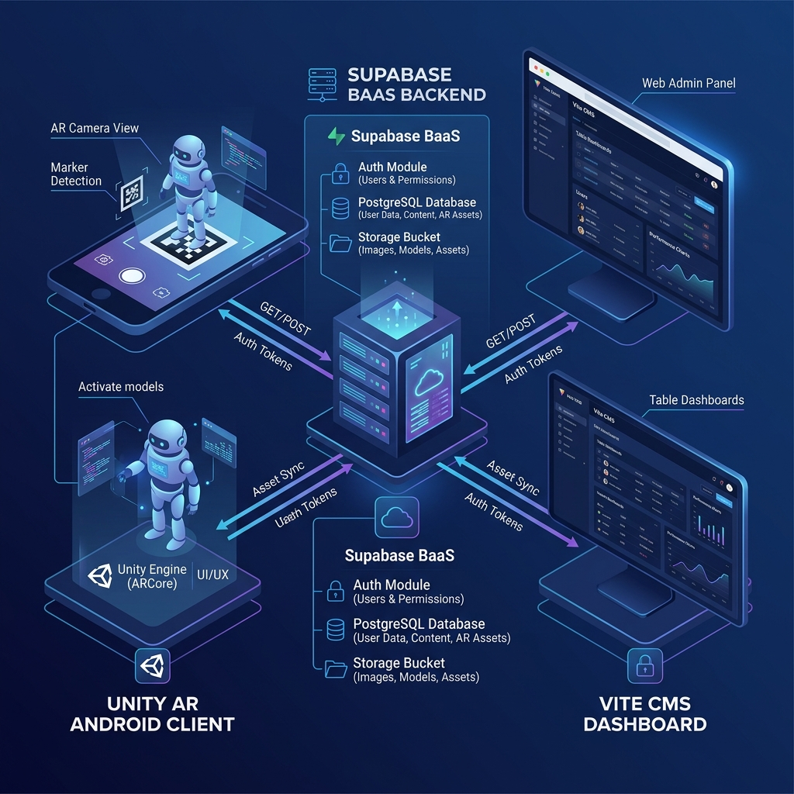

# 2. Rancangan Arsitektur Sistem
**Hubungan Aplikasi AR Android, Admin Dashboard, dan Layanan Supabase Backend**  
**Proyek Djaswita AR — Muhamad Sidik (NIM: 7708220034)**

---

## 1. Pendahuluan & Konseptual Arsitektur

Rancangan arsitektur sistem **Djaswita AR** didasarkan pada arsitektur Client-Server 3-Tier yang terdesentralisasi namun terintegrasi secara real-time. Sistem ini memisahkan secara tegas antara penyedia data (Backend-as-a-Service Supabase), antarmuka manajemen data (Vite Web Admin CMS), dan antarmuka interaksi visual augmented reality (Unity AR Android Client).

Pilihan arsitektur ini didasari oleh kebutuhan instansi (PT Jaswita Jabar) untuk menyajikan konten promosi wisata yang sangat dinamis. Pada aplikasi AR konvensional, setiap pembaruan aset 3D atau video mengharuskan pengembang untuk melakukan build ulang (.apk) dan mendistribusikannya kembali ke perangkat. Dengan memisahkan penyimpanan aset pada Supabase Storage dan metadata pada database PostgreSQL, konten visual dapat diperbarui secara dinamis oleh administrator melalui CMS, dan langsung dimuat oleh aplikasi mobile di lapangan tanpa proses instalasi ulang.

> [!NOTE]
> Desentralisasi komponen memastikan skalabilitas tinggi: CMS dapat diakses dari browser manapun oleh admin, sedangkan aplikasi AR Android berfokus sepenuhnya pada rendering model 3D dan tracking marker secara optimal.

---

## 2. Deskripsi Komponen Utama Sistem

Sistem Djaswita AR terdiri dari tiga pilar teknologi utama:

### A. Aplikasi Mobile AR Android (Unity Client)
Aplikasi mobile Android bertindak sebagai front-end visual utama bagi para pengunjung pameran PT Jaswita Jabar. Spesifikasi teknis dan fitur utama komponen ini meliputi:
*   **Engine & Pipeline**: Dikembangkan menggunakan engine Unity 6 (versi LTS) dengan pipeline grafis Universal Render Pipeline (URP) untuk optimasi rendering di perangkat mobile Android.
*   **AR Tracking**: Menggunakan SDK Vuforia Engine untuk pemindaian gambar penanda (image marker) yang berada pada buku cetak profil wisata.
*   **Integrasi API**: Memanfaatkan pustaka Unity WebRequest untuk berkomunikasi dengan API Supabase REST. Data target AR diambil saat inisialisasi aplikasi untuk mendeteksi marker baru secara dinamis.
*   **Dynamic 3D Loader**: Menggunakan pustaka glTFast untuk mengunduh, mendekompresi, dan me-render model 3D berformat GLB secara runtime langsung dari Supabase Storage.
*   **Video Streamer**: Mengintegrasikan pemutar video bawaan Unity (Video Player) yang dikonfigurasi untuk melakukan streaming file video edukasi/promosi dari Google Drive melalui perantara URL proxy.
*   **Offline & Caching**: Memiliki sistem penyimpanan internal berbasis SQLite untuk menyimpan cache target dan antrean log scan offline (Sync Queue), serta sistem LRU Caching (Least Recently Used) berkapasitas 500 MB untuk menghemat kuota internet dan mempercepat loading marker.

### B. Admin Dashboard Berbasis Web (Vite CMS)
Web Admin CMS merupakan pusat kendali operasional bagi administrator internal PT Jaswita Jabar. Spesifikasi teknisnya meliputi:
*   **Teknologi Core**: Dibangun menggunakan arsitektur modern berbasis Vite dan Vanilla JavaScript, memberikan performa muat halaman (page load) yang sangat cepat dan responsif.
*   **Manajemen Konten (CRUD)**: Menyediakan form interaktif untuk mengunggah gambar marker baru, memasukkan tautan model 3D (GLB), dan menetapkan deskripsi visual wisata.
*   **Analitik Real-time**: Mengmengintegrasikan pustaka visualisasi grafik (Chart.js / ApexCharts) untuk membaca data pemindaian secara real-time dari Supabase, sehingga grafik jumlah scan harian atau marker terpopuler langsung terupdate.
*   **Evaluator Marker**: Mengintegrasikan pustaka Harris Corner Detector di sisi client untuk memetakan kualitas gambar marker sebelum diunggah. Gambar dievaluasi kepadatannya dan diberi rating bintang 1-5 untuk menjamin akurasi tracking Vuforia.
*   **Keamanan & Audit Log**: Dilengkapi otentikasi login admin dan sistem keamanan Double Authentication (memerlukan PIN Superadmin) saat mengubah parameter sensitif seperti API key di `app_settings`.

### C. Cloud Backend (Supabase BaaS)
Supabase bertindak sebagai Single Source of Truth (SSoT) untuk seluruh ekosistem aplikasi. Komponen Supabase yang digunakan meliputi:
*   **PostgreSQL Database**: Database relasional PostgreSQL yang menyimpan tabel `profiles` (informasi admin), `ar_targets` (metadata marker), `scans` (log scan), `app_settings` (konfigurasi), dan `app_settings_logs` (audit log).
*   **Supabase Storage**: Penyimpanan berbasis cloud (S3-compatible) yang dibagi ke dalam beberapa bucket (seperti `targets` untuk `.glb` dan marker image) untuk menampung file gambar marker asli dan model 3D GLB.
*   **Supabase Auth & Security**: Mengelola session admin, mengamankan query database menggunakan kebijakan RLS (Row Level Security), dan mengamankan endpoint API REST.

---

## 3. Protokol dan Alur Interaksi Data

| Alur Kerja | Deskripsi Alur Interaksi | Protokol / API |
| :--- | :--- | :--- |
| **Autentikasi Admin** | Administrator menginput kredensial di CMS. CMS mengirimkan permintaan ke Supabase Auth. Jika berhasil, JWT token dikembalikan ke browser admin untuk otorisasi sesi. | HTTPS / JSON (Supabase JWT Auth) |
| **Manajemen Konten AR** | Admin mengunggah marker & model 3D di CMS. CMS memproses citra dengan Harris Corner, lalu mengunggah berkas biner ke Supabase Storage dan menyimpan metadata ke tabel `ar_targets` via REST API. | HTTPS / REST API & Supabase JS Storage Client |
| **Sinkronisasi Unity Client** | Saat aplikasi AR Android dibuka, Unity WebRequest mengirimkan GET request ke Supabase REST API dengan filter RLS aktif untuk mengunduh daftar marker aktif. Model 3D diunduh secara dinamis dari Storage jika belum ada di LRU cache. | HTTPS / REST API & glTFast Loader |
| **Pelaporan Analitik** | Setiap kali Unity berhasil memindai marker, ia mencatat event scan dan mengirimkan POST request ke tabel `scans`. Web CMS secara real-time mendengarkan perubahan data scan tersebut menggunakan Supabase Realtime (WebSockets) untuk memperbarui chart. | WebSockets (Supabase Realtime) / REST API |
| **Keamanan Modifikasi** | Untuk mengubah `app_settings`, admin harus memasukkan PIN Superadmin. Verifikasi dilakukan di sisi klien/fungsi basis data, dan setiap perubahan dicatat secara otomatis ke tabel `app_settings_logs`. | HTTPS / PostgreSQL RLS & Database Triggers |

---

## 4. Diagram Arsitektur Sistem (Visual Diagram)

Diagram berikut menggambarkan arsitektur sistem secara visual, memperlihatkan hubungan interaksi data bi-direksional antara Unity AR Android Client, Vite Web Admin CMS, dan Supabase Backend-as-a-Service:

*Gambar 3. 1 Arsitektur Sistem Aplikasi Dynamic Augmented Reality (Djaswita AR)*
