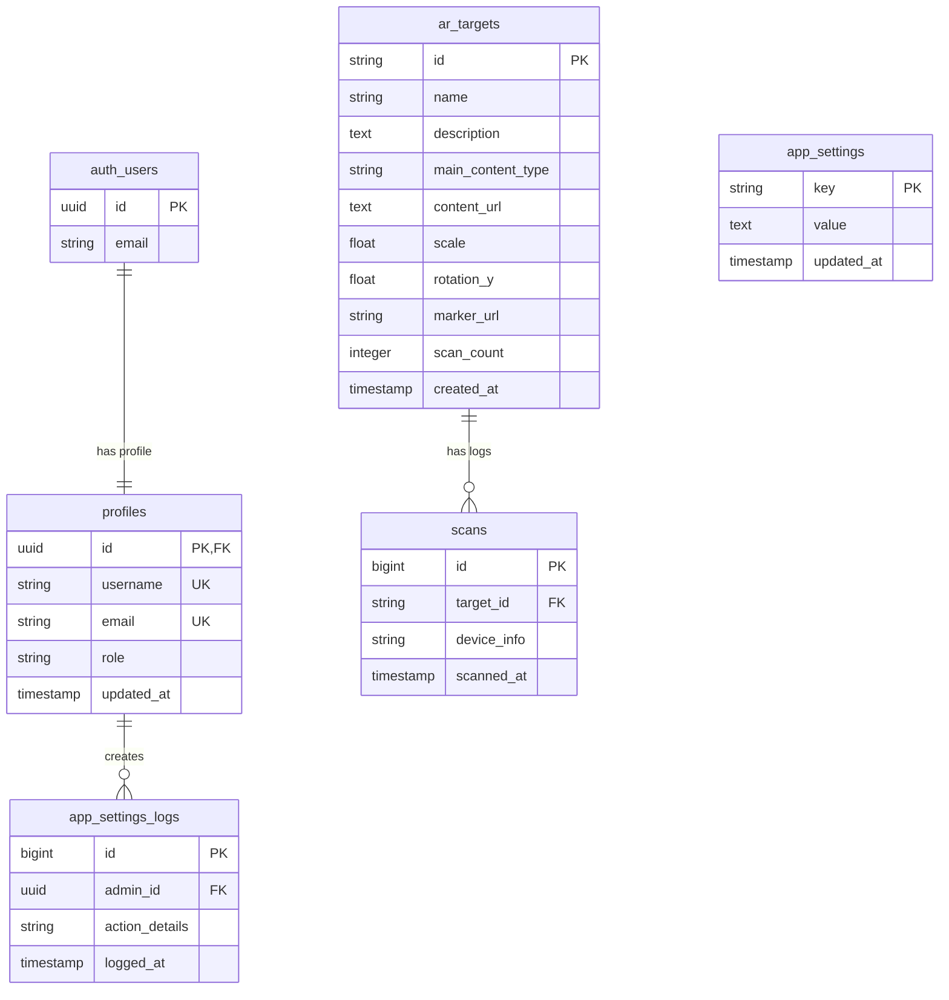

# 3. Perancangan Struktur Basis Data
**Rancangan Skema Database PostgreSQL pada Supabase BaaS**  
**Proyek Djaswita AR — Muhamad Sidik (NIM: 7708220034)**

---

## 1. Pendahuluan

Dokumen ini mendokumentasikan spesifikasi teknis dan perancangan struktur basis data (database schema) untuk sistem **Djaswita AR**. Penyimpanan data utama menggunakan basis data relasional PostgreSQL yang disediakan oleh Supabase Backend-as-a-Service (BaaS).

Struktur basis data dirancang untuk mengelola lima kebutuhan utama: autentikasi administrator, penyimpanan penanda (marker) dan multimedia AR, perekaman log pemindaian (scan) perangkat secara real-time, pengelolaan parameter konfigurasi aplikasi secara terpusat, dan pencatatan log audit keamanan sistem.

> [!NOTE]
> Seluruh tabel di bawah ini terhubung secara relasional dan dilengkapi dengan indeks, batasan integritas referensial (Foreign Key), serta aturan Row Level Security (RLS) Supabase untuk menjamin integritas dan keamanan data.

---

## 2. Diagram Hubungan Entitas (ERD)

Hubungan antarentitas dalam sistem basis data Djaswita AR digambarkan melalui diagram skema relasional di bawah ini:

---

## 3. Kamus Data & Struktur Tabel

### 3.1 Tabel: `profiles`
Tabel ini menyimpan detail profil administrator dan berelasi satu-ke-satu (1:1) dengan tabel bawaan `auth.users` dari Supabase Auth.

| Nama Kolom | Tipe Data | Constraint | Nullability | Keterangan / Deskripsi |
| :--- | :--- | :--- | :--- | :--- |
| **id** | UUID | PK, FK | NOT NULL | Berelasi dengan tabel bawaan `auth.users(id)`. |
| **username** | VARCHAR(50) | UNIQUE | NOT NULL | Nama pengguna unik untuk profil admin. |
| **email** | VARCHAR(255) | UNIQUE | NOT NULL | Alamat email resmi milik administrator. |
| **role** | VARCHAR(20) | DEFAULT 'member' | NOT NULL | Peran otorisasi admin: `superadmin`, `admin`, atau `member`. |
| **updated_at** | TIMESTAMP | DEFAULT NOW() | NOT NULL | Waktu terakhir data profil diperbarui. |

### 3.2 Tabel: `ar_targets`
Tabel master untuk menyimpan data metadata target marker AR dan konfigurasi media aset visual.

| Nama Kolom | Tipe Data | Constraint | Nullability | Keterangan / Deskripsi |
| :--- | :--- | :--- | :--- | :--- |
| **id** | VARCHAR(100) | PK | NOT NULL | ID unik target, dicocokkan dengan Vuforia Target Name. |
| **name** | VARCHAR(255) | - | NOT NULL | Nama destinasi wisata atau hotel yang ditampilkan. |
| **description** | TEXT | - | NULL | Deskripsi informasi detail konten promosi. |
| **main_content_type** | VARCHAR(30) | CHECK | NOT NULL | Jenis konten utama: `3d_model`, `image_carousel`, atau `video_streaming`. |
| **content_url** | TEXT | - | NOT NULL | URL tautan ke file aset digital (GLB, gambar carousel, atau proxy video). |
| **scale** | FLOAT8 | DEFAULT 1.0 | NOT NULL | Nilai skala normalisasi untuk visualisasi model 3D di Unity. |
| **rotation_y** | FLOAT8 | DEFAULT 0.0 | NOT NULL | Rotasi awal pada sumbu Y dalam derajat. |
| **marker_url** | TEXT | - | NOT NULL | URL file gambar marker penanda yang diunggah ke storage. |
| **scan_count** | INTEGER | DEFAULT 0 | NOT NULL | Jumlah total akumulasi pemindaian pada target. |
| **created_at** | TIMESTAMP | DEFAULT NOW() | NOT NULL | Waktu awal target AR dibuat di database. |

### 3.3 Tabel: `scans`
Tabel pencatatan transaksi aktivitas pemindaian untuk visualisasi data analitik perangkat.

| Nama Kolom | Tipe Data | Constraint | Nullability | Keterangan / Deskripsi |
| :--- | :--- | :--- | :--- | :--- |
| **id** | BIGINT | PK, IDENTITY | NOT NULL | ID log pemindaian unik, berurutan secara otomatis. |
| **target_id** | VARCHAR(100) | FK | NOT NULL | Berelasi dengan `ar_targets(id)` menggunakan aksi `ON DELETE CASCADE`. |
| **device_info** | VARCHAR(255) | - | NOT NULL | Informasi jenis perangkat dan sistem operasi Android fisik. |
| **scanned_at** | TIMESTAMP | DEFAULT NOW() | NOT NULL | Tanggal dan waktu pencatatan pemindaian terjadi. |

### 3.4 Tabel: `app_settings`
Tabel parameter global sistem yang menyimpan kredensial API dan proxy secara terpusat.

| Nama Kolom | Tipe Data | Constraint | Nullability | Keterangan / Deskripsi |
| :--- | :--- | :--- | :--- | :--- |
| **key** | VARCHAR(100) | PK | NOT NULL | Kunci konfigurasi sistem (contoh: `GDRIVE_PROXY_KEY`). |
| **value** | TEXT | - | NOT NULL | Nilai dari konfigurasi rahasia global (tersimpan terenkripsi). |
| **updated_at** | TIMESTAMP | DEFAULT NOW() | NOT NULL | Waktu terakhir konfigurasi ini diubah. |

### 3.5 Tabel: `app_settings_logs`
Tabel audit trail untuk memantau integritas konfigurasi sistem yang diubah oleh administrator.

| Nama Kolom | Tipe Data | Constraint | Nullability | Keterangan / Deskripsi |
| :--- | :--- | :--- | :--- | :--- |
| **id** | BIGINT | PK, IDENTITY | NOT NULL | ID log perubahan konfigurasi unik secara otomatis. |
| **admin_id** | UUID | FK | NOT NULL | ID administrator yang melakukan perubahan, berelasi dengan `profiles(id)`. |
| **action_details** | VARCHAR(255) | - | NOT NULL | Deskripsi aktivitas modifikasi yang dilakukan. |
| **logged_at** | TIMESTAMP | DEFAULT NOW() | NOT NULL | Waktu pencatatan log audit sistem. |

---

## 4. Hubungan Relasional dan Integritas Data

1. **ON DELETE CASCADE pada `scans.target_id`**: Jika data target AR pada tabel `ar_targets` dihapus, maka seluruh log scan pemindaian terkait pada tabel `scans` akan otomatis dibersihkan oleh server database PostgreSQL.
2. **Trigger Sinkronisasi Profil Admin**: Ketika akun pengguna baru dibuat pada modul `auth.users` Supabase, pemicu database (database trigger) akan otomatis memanggil fungsi PostgreSQL untuk menambahkan entri profil baru ke tabel `profiles` dengan setelan `role` bernilai `'member'`.

---

## 5. Indeks dan Optimasi Query

Untuk mengoptimalkan kecepatan pembacaan query dan meminimalkan latensi respons API, indeks-indeks di bawah ini diterapkan:
* **`idx_scans_scanned_at`** pada kolom `scans(scanned_at)`: Mempercepat kalkulasi visualisasi analitik performa grafik mingguan pada Dashboard CMS.
* **`idx_scans_target_id`** pada kolom `scans(target_id)`: Mengoptimalkan relasi join pencarian histori detail scan target.
* **`idx_profiles_role`** pada kolom `profiles(role)`: Menjamin efisiensi pemeriksaan hak akses otorisasi berbasis peran (RBAC) pada controller CMS.

---

## 6. Kebijakan Keamanan Row Level Security (RLS)

Keamanan tabel dijamin menggunakan kebijakan Row Level Security (RLS) PostgreSQL bawaan Supabase:
1. **Kebijakan `ar_targets`**:
   - `SELECT`: Diizinkan untuk publik (anonim & Unity client) agar konten AR dapat dimuat runtime.
   - `INSERT`, `UPDATE`, `DELETE`: Dibatasi secara ketat hanya untuk pengguna terautentikasi dengan peran `'admin'` atau `'superadmin'`.
2. **Kebijakan `scans`**:
   - `INSERT`: Diizinkan untuk publik (Unity client) agar pemindaian dari perangkat fisik dapat tercatat secara langsung.
   - `SELECT`: Hanya diperbolehkan untuk pengguna terautentikasi (semua admin).
3. **Kebijakan `app_settings` dan `app_settings_logs`**:
   - `SELECT`, `INSERT`, `UPDATE`, `DELETE`: Hanya dapat diakses oleh peran `'superadmin'` yang terverifikasi sandi ganda (Double Auth).
