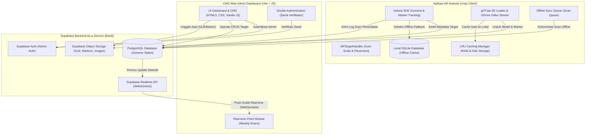

# DOKUMEN SPESIFIKASI KEBUTUHAN, ARSITEKTUR, DAN JADWAL PENGEMBANGAN SISTEM DJASWITA AR

Dokumen ini berisi spesifikasi kebutuhan fungsional sistem, rancangan arsitektur terintegrasi, perancangan struktur basis data, serta jadwal pengembangan sistem menggunakan metodologi Agile untuk proyek **Djaswita AR** (Aplikasi Mobile AR Android + CMS Web Admin Dashboard + Supabase Backend).

---

## 1. Daftar Kebutuhan Fitur Sistem (Functional Requirements)

### 1.1 Aplikasi AR Android (Unity Client)
Fungsi utama dari aplikasi mobile AR adalah mendeteksi marker fisik dan memproyeksikan konten digital secara dinamis, responsif, dan hemat memori pada perangkat seluler.

* **FR-MOB-01: Deteksi Marker Real-time**: Aplikasi harus mampu mendeteksi marker fisik terdaftar menggunakan Vuforia SDK secara real-time melalui kamera perangkat Android.
* **FR-MOB-02: Proyeksi Konten Dinamis**: Aplikasi harus mampu memuat dan menampilkan konten AR berdasarkan tipe media yang dikonfigurasi di database:
  * **3D Model**: Memuat file model 3D berformat `.glb` secara runtime menggunakan pustaka `glTFast`.
  * **Image Carousel**: Menampilkan slideshow gambar 2D interaktif.
  * **Video Streaming**: Memutar video promosi yang dialirkan dari Google Drive melalui URL proxy.
* **FR-MOB-03: Auto-Scale & Auto-Placement**: Aplikasi harus secara otomatis melakukan perhitungan skala normalisasi (auto-scale) dan penempatan posisi model 3D berdasarkan bounding box objek agar tampil proporsional tanpa clipping di mata pengguna.
* **FR-MOB-04: Manajemen Memori GPU (RAM)**: Aplikasi harus membatasi texture GPU maks 12 gambar marker aktif menggunakan mekanisme pengosongan memori (eviction) untuk mencegah kebocoran memori (memory leak).
* **FR-MOB-05: LRU Disk Caching**: Aplikasi harus menyediakan penyimpanan cache lokal (`JawitaCache`) hingga kapasitas 500 MB untuk menyimpan model 3D dan marker yang sering diakses. Berkas lama akan dihapus otomatis jika penuh (Least Recently Used).
* **FR-MOB-06: Deteksi Koneksi & Offline Fallback**: Aplikasi harus mendeteksi status koneksi internet. Jika offline, aplikasi harus memunculkan overlay pemberitahuan offline dan mengalihkan pembacaan metadata ke database SQLite lokal agar konten yang ter-cache tetap bisa ditampilkan.
* **FR-MOB-07: Offline Sync Queue**: Setiap pemindaian yang dilakukan dalam kondisi offline harus disimpan dalam antrean sinkronisasi lokal (SQLite) dan akan dikirim secara massal (*batch sync*) ke Supabase setelah koneksi internet pulih.
* **FR-MOB-08: Jeda Pelacakan (Delayed Hide Logic)**: Ketika kamera kehilangan pelacakan marker fisik, aplikasi harus menahan penyembunyian konten AR selama 0.5 detik. Jika marker terdeteksi kembali dalam jeda tersebut, visualisasi AR dipertahankan tanpa kedip (flicker-free).

### 1.2 Dashboard CMS Web Admin
Dashboard berbasis web berfungsi sebagai pusat pengelolaan data target, konfigurasi sistem, audit keamanan, dan visualisasi statistik pemindaian.

* **FR-ADM-01: Autentikasi Pengguna & RBAC**: Sistem harus mendukung otentikasi login dengan masa kedaluwarsa sesi 12 jam, serta membatasi akses berdasarkan peran (Role-Based Access Control):
  * **Superadmin**: Akses penuh termasuk CRUD admin, verifikasi sandi untuk konfigurasi sistem, dan audit log.
  * **Admin**: Akses operasional untuk mengelola target AR (CRUD) dan memantau statistik.
  * **Member**: Akses baca-saja (read-only) untuk memantau grafik statistik dan log tanpa izin mengubah data.
* **FR-ADM-02: Manajemen Target AR (CRUD)**: Admin harus dapat menambah, melihat, memperbarui, dan menghapus target AR beserta file penanda (marker) dan URL aset media.
* **FR-ADM-03: Analisis Kualitas Marker**: Sistem harus menganalisis kualitas gambar marker yang diunggah menggunakan algoritme Harris Corner Detector secara real-time untuk mendeteksi kontras, sebaran fitur, dan pola repetitif dengan rating bintang 1-5.
* **FR-ADM-04: Visualisasi Grafik Analitik**: Dashboard harus menampilkan grafik statistik pemindaian mingguan secara real-time yang terhubung via WebSocket (Supabase Realtime API).
* **FR-ADM-05: Manajemen Konfigurasi & Double Authentication**: Konfigurasi sistem sensitif (seperti Google Drive API key, Supabase Credentials) hanya dapat diubah oleh Superadmin setelah berhasil melalui verifikasi kata sandi kedua (Double Authentication).
* **FR-ADM-06: Pencatatan Log Audit (Audit Logs)**: Setiap aktivitas perubahan konfigurasi sistem sensitif harus dicatat secara otomatis dalam tabel `app_settings_logs`.
* **FR-ADM-07: Monitoring Heartbeat Database**: Dashboard harus memantau status keaktifan koneksi database (heartbeat) secara berkala dan menampilkan indikator status koneksi.

---

## 2. Rancangan Arsitektur Sistem

Arsitektur Sistem Djaswita AR dibangun menggunakan pendekatan terintegrasi antara aplikasi klien berbasis Unity, antarmuka administrasi web berbasis Vite, dan backend berbasis Supabase. Hubungan antar komponen sistem ini dapat digambarkan sebagai berikut:

### 2.1 Komponen Aplikasi AR Android (Unity Client)
* **Vuforia SDK (AR Camera)**: Mengambil input kamera secara real-time dan melakukan image tracking terhadap marker fisik.
* **ARTargetHandler**: Mengatur visualisasi target AR di layar perangkat, termasuk inisialisasi model, rotasi Y sumbu default, normalisasi skala berdasarkan ukuran bounding box model, serta penanganan jeda pelacakan.
* **AssetLoader**: Mengunduh dan memuat model 3D (`glTFast`) atau memutar video promosi Google Drive via proxy URL.
* **Cache & Sync Manager**: Mengatur penyimpanan cache offline (`JawitaCache` & SQLite lokal) dan antrean sinkronisasi scan untuk pengiriman data ketika koneksi kembali online.

### 2.2 Komponen CMS Web Admin Dashboard
* **UI Dashboard & CMS**: Interface bagi administrator untuk mengelola data target AR dan melacak performa sistem.
* **Double Authentication**: Lapisan keamanan tambahan yang mengharuskan admin memasukkan kata sandi sebelum mengubah konfigurasi sensitif.
* **Chart Module**: Visualisasi grafik interaktif mingguan yang diperbarui secara instan via WebSocket.

### 2.3 Komponen Supabase BaaS (Backend)
* **Supabase Auth**: Mengamankan akses login admin dan mengontrol role-based access.
* **PostgreSQL Database**: Menyimpan data relasional target AR, log pemindaian, profil admin, dan konfigurasi aplikasi.
* **Supabase Storage**: Object storage berbasis cloud untuk menampung file aset model 3D (`.glb`) dan file gambar marker.
* **Realtime API**: Mengirimkan pembaruan data database langsung ke dashboard tanpa perlu memuat ulang halaman.

---

## 3. Perancangan Struktur Basis Data Supabase

Database PostgreSQL Supabase terdiri dari 5 tabel utama yang saling berelasi untuk mengelola data target AR, data scan, profil admin, konfigurasi sistem, dan log audit keamanan.

### 3.1 Tabel `profiles`
Tabel ini digunakan untuk menyimpan detail data profil administrator dan berelasi dengan tabel bawaan `auth.users` milik Supabase Auth.

| Kolom | Tipe Data | Deskripsi |
| :--- | :--- | :--- |
| **id** (PK) | UUID | ID unik pengguna, berelasi dengan `auth.users(id)`. |
| **username** (UQ)| VARCHAR | Nama pengguna unik untuk keperluan login alternatif. |
| **email** | VARCHAR | Alamat email resmi administrator. |
| **role** | VARCHAR | Tingkat otorisasi admin (`superadmin`, `admin`, atau `member`). |
| **updated_at** | TIMESTAMP | Waktu pembaruan profil terakhir. |

### 3.2 Tabel `ar_targets`
Tabel ini menampung metadata target marker AR dan konten multimedia yang diasosiasikan dengan penanda tersebut.

| Kolom | Tipe Data | Deskripsi |
| :--- | :--- | :--- |
| **id** (PK) | VARCHAR | ID target unik yang dicocokkan dengan Vuforia Target Name. |
| **name** | VARCHAR | Nama destinasi wisata atau hotel yang ditampilkan di UI. |
| **description** | TEXT | Deskripsi detail promosi wisata. |
| **main_content_type** | VARCHAR | Tipe konten utama (`3d_model`, `image_carousel`, atau `video_streaming`). |
| **content_url** | TEXT | URL file aset digital (GLB model, carousel images, atau streaming video). |
| **scale** | FLOAT | Nilai pengali skala model 3D (default: 1.0). |
| **rotation_y** | FLOAT | Rotasi awal pada sumbu Y dalam derajat (default: 0.0). |
| **marker_url** | VARCHAR | URL gambar penanda (marker) fisik yang diunggah. |
| **scan_count** | INTEGER | Jumlah pemindaian terakumulasi untuk perhitungan cepat. |
| **created_at** | TIMESTAMP | Waktu pembuatan data target pertama kali. |

### 3.3 Tabel `scans`
Tabel transaksi untuk mencatat log aktivitas pemindaian marker oleh pengguna demi kebutuhan visualisasi statistik.

| Kolom | Tipe Data | Deskripsi |
| :--- | :--- | :--- |
| **id** (PK) | BIGINT | ID transaksi scan unik, auto increment. |
| **target_id** (FK) | VARCHAR | Target AR yang berhasil dipindai, berelasi ke `ar_targets.id` (ON DELETE CASCADE). |
| **device_info** | VARCHAR | Informasi model smartphone dan versi sistem operasi Android. |
| **scanned_at** | TIMESTAMP | Tanggal dan waktu tepat saat pemindaian dilakukan. |

### 3.4 Tabel `app_settings`
Tabel konfigurasi global sistem untuk menyimpan kunci API dan parameter sensitif lainnya.

| Kolom | Tipe Data | Deskripsi |
| :--- | :--- | :--- |
| **key** (PK) | VARCHAR | Nama konfigurasi global (contoh: `GDRIVE_PROXY_KEY`). |
| **value** | TEXT | Nilai rahasia dari konfigurasi (disimpan terenkripsi). |
| **updated_at** | TIMESTAMP | Tanggal perubahan konfigurasi terakhir dilakukan. |

### 3.5 Tabel `app_settings_logs`
Tabel audit log untuk mencatat histori perubahan konfigurasi pada tabel `app_settings`.

| Kolom | Tipe Data | Deskripsi |
| :--- | :--- | :--- |
| **id** (PK) | BIGINT | ID log unik, auto increment. |
| **admin_id** (FK) | UUID | ID admin yang melakukan perubahan, berelasi ke `profiles.id`. |
| **action_details** | VARCHAR | Keterangan aktivitas modifikasi konfigurasi yang dilakukan. |
| **logged_at** | TIMESTAMP | Waktu log dicatat secara otomatis oleh sistem. |

---

## 4. Rancangan Jadwal Pengembangan Agile

Pengembangan sistem Djaswita AR menggunakan kerangka kerja Agile Scrum dengan pembagian Sprint berdurasi 1-2 minggu. Jadwal pengembangan berikut merencanakan estimasi waktu untuk tahap pengembangan berikutnya demi menstabilkan, menguji, dan meluncurkan sistem.

| Sprint | Durasi | Aktivitas Utama | Deliverables |
| :--- | :--- | :--- | :--- |
| **Sprint 3: Pemetaan Kualitas & Keamanan** | 2 Minggu | 1. Integrasi fitur evaluasi kualitas marker (Harris Corner) di CMS. 2. Implementasi Double Authentication untuk configurator. 3. Penerapan paginasi logs pada audit trails. | - Evaluator Harris Corner aktif di CMS. - Keamanan halaman setting diperketat. - Paginasi performansi log audit stabil. |
| **Sprint 4: Optimasi Cache & Offline Support** | 2 Minggu | 1. Implementasi LRU Caching Manager pada Unity Client. 2. Integrasi SQLite lokal untuk offline data storage. 3. Pembuatan antrean sinkronisasi log scan offline. | - Cache manager 500 MB & GPU 12 texture aktif. - Pemindaian offline didukung. - Mekanisme auto-sync log scan stabil. |
| **Sprint 5: Pengujian & Validasi Kinerja** | 1 Minggu | 1. Pengujian fungsionalitas sistem (Black-box testing). 2. Profiling konsumsi memori GPU pada Android build. 3. Uji coba pengaliran video Google Drive. | - Laporan pengujian fungsionalitas diselesaikan. - Beban RAM/GPU stabil di bawah batas crash. - Streaming lancar. |
| **Sprint 6: Deployment & Penutupan** | 1 Minggu | 1. Final release build APK Aplikasi AR Android. 2. Deployment CMS Web Admin ke web hosting. 3. Pembersihan file yatim (orphaned files) di Supabase Storage. | - Link unduh APK versi final siap. - Dashboard CMS live di internet. - Ruang Supabase Storage optimal. |
