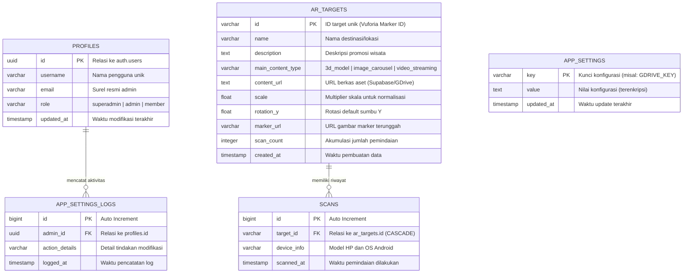
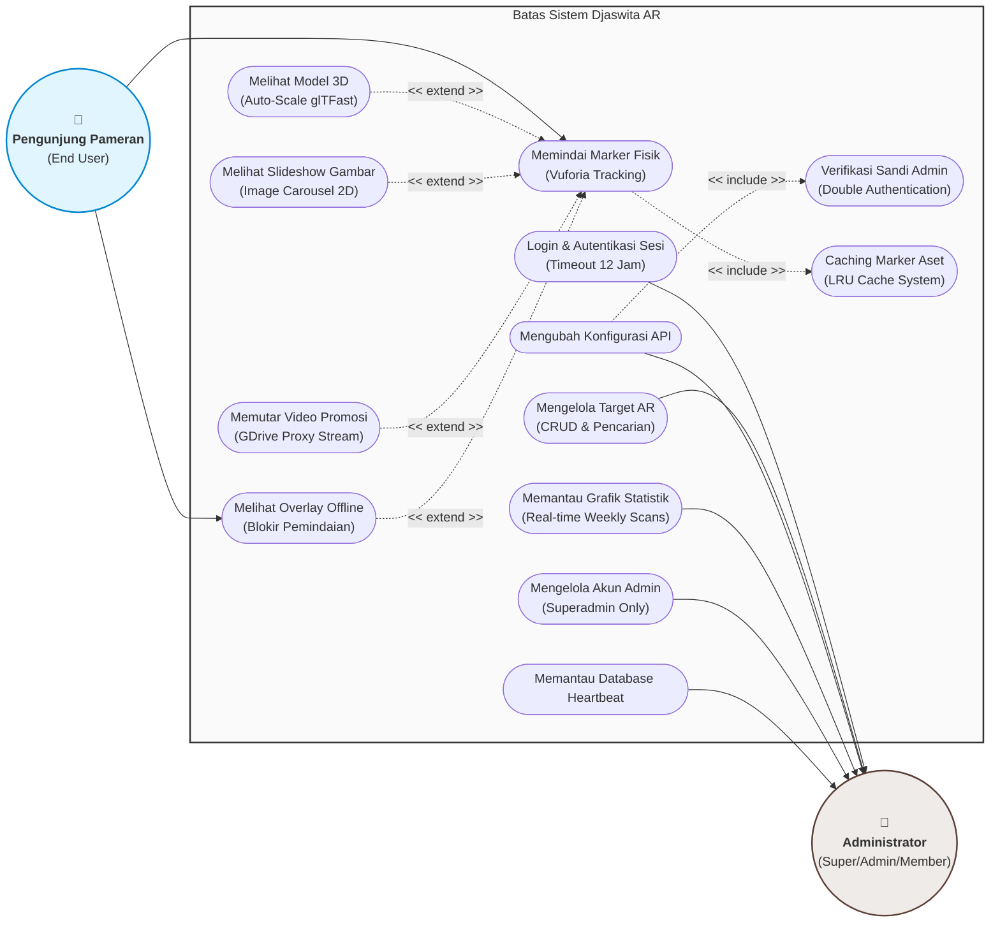

# Spesifikasi Visual & Diagram Sistem Djaswita AR

Dokumen ini mendokumentasikan diagram arsitektur basis data, model use case, dan flowchart alur operasional untuk sistem **Djaswita AR** (Aplikasi Mobile AR + Web Admin Dashboard CMS + Supabase Backend). 

Seluruh diagram di bawah ini diimplementasikan menggunakan **Mermaid.js** standar untuk memastikan kemudahan integrasi dan pemeliharaan jangka panjang.

---

## 1. Entity Relationship Diagram (ERD) Basis Data Supabase

Diagram hubungan entitas (ERD) berikut menggambarkan struktur tabel PostgreSQL di Supabase. Database ini mengelola data autentikasi pengguna, data target marker, log analitik pemindaian, serta catatan konfigurasi dan audit internal.

### Penjelasan Relasi:
1. **`PROFILES` ke `APP_SETTINGS_LOGS` (1:N)**: Setiap administrator memiliki riwayat audit log aktivitas yang mencatat perubahan konfigurasi sensitif (Supabase/Google Drive) demi transparansi keamanan.
2. **`AR_TARGETS` ke `SCANS` (1:N)**: Satu target penanda (marker) dapat dipindai berkali-kali oleh banyak pengguna unik dari perangkat Android yang berbeda. Jika sebuah target dihapus, seluruh data riwayat scan yang terasosiasi dengannya otomatis terhapus secara berantai (`ON DELETE CASCADE`).

---

## 2. Use Case Diagram Sistem Augmented Reality Dinamis

Use case diagram di bawah ini merinci fungsionalitas dan batas sistem (*system boundary*) berdasarkan dua aktor utama: **Administrator** (termasuk sub-role Superadmin, Admin, Member) dan **Pengunjung Pameran (End User)**.

---

## 3. Flowchart Alur Pemindaian dan Penampilan Konten Augmented Reality

Flowchart ini memetakan langkah-langkah logika mendalam yang dieksekusi oleh aplikasi klien seluler (Unity Client) sejak aplikasi pertama kali diluncurkan, pemeriksaan status jaringan, proses pemindaian Vuforia, pengunduhan & pembersihan cache LRU marker, hingga penampilan visual AR yang dinamis di layar perangkat. 

*Catatan: Pemindaian diblokir sepenuhnya saat offline dengan memunculkan **Overlay Offline** untuk meminimalisir kegagalan penampilan pemutaran video Google Drive.*

```mermaid
flowchart TD
    %% Mulai
    Start([Mulai Aplikasi Unity Client]) --> InitConn{Apakah Perangkat<br>Memiliki Internet?}

    %% Cabang Inisialisasi Koneksi
    InitConn -- Ya (Online) --> FetchOnline[Unduh Kredensial & Metadata Terbaru dari Supabase]
    FetchOnline --> ActiveVuforia[Aktifkan Kamera & Vuforia SDK]

    %% Cabang Offline (Blokir Pemindaian)
    InitConn -- Tidak (Offline) --> ShowOfflineOverlay[Tampilkan Overlay Offline & Blokir Pemindaian]
    ShowOfflineOverlay --> BlockScan[Aplikasi Menunggu Jaringan Aktif Kembali]
    BlockScan --> CheckNetAgain{Apakah Koneksi<br>Kembali Aktif?}
    CheckNetAgain -- Tidak --> BlockScan
    CheckNetAgain -- Ya --> FetchOnline

    %% Proses Pemindaian
    ActiveVuforia --> ScanLoop{Apakah Marker<br>Fisik Terdeteksi?}
    ScanLoop -- Tidak --> ScanLoop
    ScanLoop -- Ya --> ResolveTarget[Ekstrak ID Target dari Vuforia Dataset]

    %% Pemeriksaan Cache Marker (LRU Caching)
    ResolveTarget --> CheckCache{Apakah Berkas Marker<br>Ada di Disk Cache Lokal?}
    
    CheckCache -- Tidak --> DownloadMarker[Unduh Marker dari Supabase Storage]
    DownloadMarker --> SaveCache[Simpan Berkas Marker di Disk Lokal]
    SaveCache --> CheckLRU{Apakah Ukuran Cache Marker<br>Melebihi Batas?}
    
    CheckLRU -- Ya --> EvictLRU[Hapus Aset Marker Tertua yang Jarang Digunakan]
    EvictLRU --> CheckType
    CheckLRU -- Tidak --> CheckType

    CheckCache -- Ya --> ReadCache[Baca Berkas Marker Langsung dari Penyimpanan Lokal]
    ReadCache --> CheckType

    %% Percabangan Jenis Media Konten
    CheckType{Apa Jenis Konten Utama<br>dari Target Terdeteksi?}
    
    CheckType -- "3D Model (.glb)" --> ParseGLB[Parse File GLB menggunakan glTFast]
    ParseGLB --> AutoScale[Hitung Normalisasi Skala Bounding Box]
    AutoScale --> Render3D[Render Model 3D Melayang Presisi di Atas Marker]
    Render3D --> RecordScan

    CheckType -- "Image Carousel (2D)" --> LoadImages[Muat Gambar-Gambar ke RAM GPU Texture]
    LoadImages --> LimitRAM{Apakah Gambar di RAM<br>Lebih dari 12 Tekstur?}
    LimitRAM -- Ya --> EvictRAM[Hapus Alokasi Tekstur Tertua dari Memori]
    EvictRAM --> RenderCarousel
    LimitRAM -- Tidak --> RenderCarousel
    RenderCarousel[Render Canvas 2D Melayang dengan Navigasi Slide Arrow]
    RenderCarousel --> RecordScan

    CheckType -- "Video Streaming" --> ProxyGDrive[Konversi Tautan File Google Drive Menjadi Proxy URL]
    ProxyGDrive --> VideoPlayer[Alirkan Video ke Unity VideoPlayer dengan Buffering]
    VideoPlayer --> RenderVideo[Render Video Melayang Dilengkapi Kontrol Play/Pause]
    RenderVideo --> RecordScan

    %% Perekaman Log Analitik
    RecordScan --> IncrementStats[Kirim Tambah Scan & Log Aktivitas ke Supabase]
    IncrementStats --> PushRealtime[Supabase Realtime Memicu Update Grafik Dashboard]
    PushRealtime --> TrackingLostCheck

    %% Penanganan Tracking Lost & Delay
    TrackingLostCheck{Apakah Kamera Kehilangan<br>Pelacakan Marker?}
    TrackingLostCheck -- Tidak --> TrackingLostCheck
    TrackingLostCheck -- Ya --> DelayTimer[Aktifkan Jeda Waktu Pengampunan 0.5 Detik]
    
    DelayTimer --> RecaptureCheck{Apakah Marker<br>Terdeteksi Kembali?}
    RecaptureCheck -- Ya (Sebelum 0.5s) --> MaintainRender[Pertahankan Tampilan Konten AR Tanpa Kedip]
    MaintainRender --> TrackingLostCheck
    
    RecaptureCheck -- Tidak (Setelah 0.5s) --> HideContent[Sembunyikan Konten AR dengan Aman]
    HideContent --> ScanLoop
```

