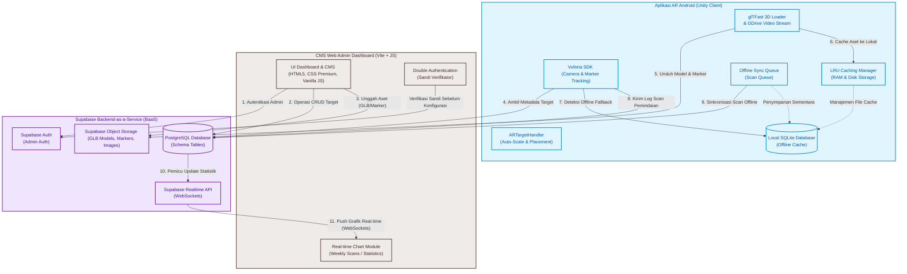
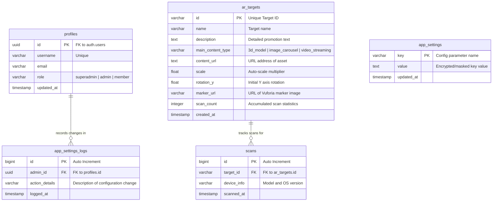

# Djaswita AR - System Architecture & Schema Specification

Dokumen ini menjelaskan arsitektur terintegrasi, aliran data, dan skema database untuk proyek **Djaswita AR** yang terdiri dari tiga komponen utama: **Aplikasi AR Android (Unity Client)**, **CMS Web Admin Dashboard**, dan **Supabase Backend-as-a-Service (BaaS)**.

---

## 1. Diagram Arsitektur Sistem (Mermaid Diagram)

Berikut adalah diagram blok arsitektur terintegrasi yang menunjukkan hubungan komponen, protokol komunikasi, dan alur sinkronisasi data secara *real-time*:

---

## 2. Aliran Data Utama (Core Data Flows)

### A. Alur Sinkronisasi Konten Dinamis (Online Mode)
1. **CMS Web Admin** mengunggah file marker (.png/.jpg) dan model 3D (.glb) ke **Supabase Storage**, lalu mendaftarkan metadata target (ID, nama, skala, rotasi) ke database **PostgreSQL** (`ar_targets`).
2. Saat **Aplikasi AR Android** dijalankan dengan internet aktif, ia memanggil API Supabase untuk mengunduh daftar metadata target terbaru.
3. Metadata tersebut disimpan ke dalam database **SQLite lokal** sebagai cadangan luring.
4. Ketika kamera mendeteksi marker fisik, **Vuforia SDK** memicu *event* penemuan.
5. **ARTargetHandler** mengunduh file model 3D dari **Supabase Storage** (jika belum ada di cache disk lokal), lalu menggunakan pustaka **glTFast** untuk memuat model 3D secara runtime.
6. **ARTargetHandler** melakukan normalisasi skala secara dinamis berdasarkan volume batas (*bounding box*) model 3D agar objek AR tampil rapi dan proporsional.

> [!TIP]
> **Delayed Hide Logic:** Saat marker terhalang sesaat, sistem menahan rendering selama 0.5 detik. Jika dalam masa jeda ini marker terlihat kembali, objek AR langsung pulih secara instan tanpa perlu memicu proses pemuatan ulang (*flicker-free*).

---

### B. Alur Toleransi Kesalahan (Offline Fallback & Sync)
1. Jika aplikasi mobile diluncurkan **tanpa koneksi internet**, sistem mendeteksi kegagalan koneksi (*Database Connection Loss*).
2. Sistem secara otomatis mengalihkan sumber data (*fallback*) ke **Local SQLite Database** yang menyimpan salinan cache data target terakhir.
3. Pengguna tetap dapat memindai marker dan melihat model 3D yang sebelumnya sudah terunduh di folder penyimpanan lokal perangkat.
4. Setiap aktivitas pemindaian saat luring akan dimasukkan ke dalam antrean **Offline Sync Queue** di SQLite lokal.
5. Begitu perangkat terhubung kembali ke internet, antrean scan tersebut dikirimkan secara massal (*batch sync*) ke database **Supabase PostgreSQL** untuk memperbarui statistik pameran.

---

### C. Alur Pembersihan Memori Pintar (LRU Cache Manager)
Untuk menjaga agar perangkat Android berspesifikasi rendah tidak mengalami *crash* akibat kehabisan memori GPU atau penyimpanan, sistem menerapkan aturan berikut secara otomatis:
* **LRU Disk Cache (Batas 500 MB):** Folder lokal `JawitaCache` dipantau ukurannya. Jika melebihi 500 MB pada saat pengunduhan model baru, berkas aset yang paling lama/jarang diakses akan dihapus secara otomatis hingga ukuran cache kembali di bawah batas aman.
* **RAM GPU Cache (Batas 12 Tekstur):** Memori texture GPU dibatasi maksimal 12 gambar marker aktif. Jika admin mendaftarkan sangat banyak marker dan pengguna memindai semuanya secara beruntun, tekstur terlama akan di-evict (dihancurkan) dari memori GPU untuk mencegah kebocoran memori (*memory leak*).

---

## 3. Skema Basis Data Supabase (PostgreSQL Schema)

Database terdiri dari 5 tabel utama yang saling terhubung untuk mengelola autentikasi admin, riwayat audit, target AR, dan pelacakan analitik scan:

---

### Deskripsi Kolom Tabel Utama

#### 1. Tabel `ar_targets` (Data Target AR Interaktif)
Menyimpan semua data marker fisik beserta properti aset digital dinamis yang terasosiasi dengannya.
* `id` (Primary Key): ID unik yang dicocokkan dengan Vuforia Target Name (misal: `trg-candi`).
* `name`: Judul destinasi wisata atau hotel yang ditampilkan di UI.
* `description`: Teks deskripsi promosi terperinci.
* `main_content_type`: Menentukan jenis media utama (`3d_model` untuk file GLB, `image_carousel` untuk slideshow gambar, atau `video_streaming` untuk pemutaran video).
* `content_url`: Tautan langsung aset digital di Supabase Storage atau Google Drive.
* `scale`: Angka pengali skala (misal: `1.2`) untuk auto-normalisasi visual di Unity.
* `rotation_y`: Sudut rotasi sumbu Y awal agar model menghadap ke arah yang tepat di mata kamera.
* `marker_url`: Tautan gambar marker yang diunggah.
* `scan_count`: Jumlah akumulasi pemindaian sukses untuk mempermudah perhitungan statistik cepat.

#### 2. Tabel `scans` (Data Log Analitik Aktivitas Scan)
Mencatat detail aktivitas transaksi pemindaian oleh pengguna untuk visualisasi analitik pada dashboard.
* `id` (Primary Key): Auto increment.
* `target_id` (Foreign Key): Terhubung ke `ar_targets.id` (dihapus dengan aturan CASCADE jika target dihapus).
* `device_info`: Menyimpan string informasi sistem operasi perangkat (misal: `Samsung Galaxy S22 - Android 13`).
* `scanned_at`: Waktu/tanggal pemindaian presisi.

#### 3. Tabel `profiles` (Data Hak Akses Administrator)
Menyimpan data profil admin yang terintegrasi secara aman dengan layanan autentikasi utama `auth.users` bawaan Supabase.
* `id` (Primary Key): ID pengguna UUID yang terhubung langsung dengan Supabase Auth.
* `username`: Nama unik untuk keperluan login alternatif tanpa email.
* `email`: Alamat surel resmi administrator.
* `role`: Menentukan izin akses antarmuka (`superadmin` untuk hak penuh, `admin` untuk hak operasional, atau `member` untuk mode baca-saja/read-only).

#### 4. Tabel `app_settings` & `app_settings_logs` (Pengaturan API & Audit Logs)
Menyimpan kredensial API sensitif secara terenkripsi dan mendokumentasikan setiap riwayat perubahan yang dilakukan untuk audit keamanan internal.
* `app_settings` menyimpan key-value seperti `SUPABASE_API_KEY` dan `GOOGLE_DRIVE_SECRET`.
* `app_settings_logs` merekam ID administrator, jenis perubahan konfigurasi, serta waktu log dicatat untuk menghindari manipulasi parameter secara ilegal tanpa persetujuan superadmin (*Jejak Audit Keamanan*).
