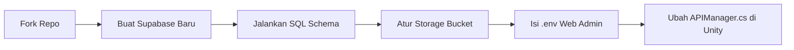

# Panduan Fork & Duplikasi Proyek (Anti-Collision Guide)

Panduan ini ditujukan bagi pengembang atau tim lain yang ingin melakukan **fork** atau menyalin repositori **Jaswita AR** untuk membuat aplikasi Augmented Reality serupa yang mandiri. 

Ikuti panduan langkah-demi-langkah ini agar sistem Web Admin dan Unity Client Anda terhubung penuh ke database Anda sendiri, serta **tidak mengalami tabrakan data (crash/collision)** dengan database dan cloud storage milik pengembang asli.

---

## Alur Singkat Isolasi Sistem


---

## Langkah 1: Fork dan Kloning Repositori
1. Klik tombol **Fork** di pojok kanan atas halaman repositori GitHub ini untuk menyalin proyek ke akun GitHub Anda sendiri.
2. Kloning repositori hasil fork Anda ke komputer lokal menggunakan Git Bash / Terminal:
   ```bash
   git clone https://github.com/USERNAME-ANDA/DjaswitaAR-Fix.git
   cd DjaswitaAR-Fix
   ```

---

## Langkah 2: Menyiapkan Server Backend Mandiri (Supabase)
Anda memerlukan server backend sendiri untuk menyimpan data marker dan menerima log scan.
1. Buat akun gratis di **[Supabase](https://supabase.com)**.
2. Klik **New Project** dan isi parameter proyek Anda (disarankan memilih region terdekat seperti **Singapore**).
3. Setelah proyek aktif, buka menu **Settings (ikon roda gigi) > API** di panel kiri, lalu salin kredensial berikut:
   * **Project URL**: Sebagai alamat gerbang API database Anda.
   * **Anon Public API Key**: Kunci publik JWT panjang untuk komunikasi klien.

---

## Langkah 3: Inisialisasi Database Anda
Agar database baru Anda memiliki tabel dan logika sistem yang lengkap, jalankan perintah migrasi SQL berikut:
1. Di dashboard Supabase, buka menu **SQL Editor** pada navigasi kiri.
2. Klik **New Query**, lalu salin seluruh kode SQL pembuatan tabel dari berkas **[README.md](./README.md#4-konfigurasi-database-supabase-langkah-wajib)**.
3. Klik tombol **Run** di pojok kanan bawah. Pastikan semua pesan sukses tampil (*Success. No rows returned*).

---

## Langkah 4: Konfigurasi Web Admin (CMS)
1. Buka folder `WebAdmin/` di dalam folder proyek menggunakan teks editor pilihan Anda (VS Code, dll.).
2. Buat file baru bernama **`.env`** di dalam folder `WebAdmin/`.
3. Tulis kredensial Supabase pribadi Anda dengan format berikut:
   ```env
   VITE_SUPABASE_URL=https://id-proyek-supabase-anda.supabase.co
   VITE_SUPABASE_ANON_KEY=anon-public-key-jwt-sangat-panjang-milik-anda
   ```
   > [!WARNING]
   > Jangan pernah mengunggah berkas `.env` ini ke GitHub! Pastikan file ini terdaftar di dalam `.gitignore` Anda.
4. Jalankan perintah instalasi dan jalankan server web lokal:
   ```bash
   npm install
   npm run dev
   ```
5. Akses CMS Web Admin Anda melalui tautan lokal (misalnya `http://localhost:5173`).

---

## Langkah 5: Konfigurasi Aplikasi Unity Client (AR)
Agar aplikasi mobile Unity Anda tidak "nyangkut" mengirim data ke database pengembang asli, Anda wajib mengubah kredensial gerbang awalnya:
1. Buka folder proyek menggunakan **Unity Hub** (direkomendasikan menggunakan **Unity 6**).
2. Di panel Project Unity, buka direktori skrip: `Assets/Scripts/`.
3. Buka file skrip bernama **`APIManager.cs`**.
4. Cari baris variabel *Master Fallback* (biasanya di baris awal kelas) dan ubah nilainya dengan kredensial Supabase pribadi Anda:
   ```csharp
   // Ganti string di bawah ini dengan kredensial Supabase Anda sendiri!
   private string masterBaseUrl = "https://id-proyek-supabase-anda.supabase.co";
   private string masterApiKey = "anon-public-key-jwt-sangat-panjang-milik-anda";
   private string masterGDriveApiKey = "api-key-google-drive-anda-jika-ada";
   ```
5. Simpan file skrip tersebut. Sekarang, aplikasi Unity Anda akan menargetkan server database pribadi Anda saat dijalankan.

---

## Langkah 6: Setup Supabase Storage Bucket
Web Admin membutuhkan Cloud Storage untuk menyimpan gambar marker (.png/.jpg), model 3D (.glb), dan file video (.mp4).
1. Buka menu **Storage** pada dashboard Supabase Anda.
2. Buat bucket baru dengan mengklik **Create Bucket**:
   * **Bucket Name**: `ar-media`
   * **Public Bucket**: **Wajib diaktifkan (Active/Public)** agar aset dapat diunduh langsung oleh aplikasi Unity.
3. Buat empat folder utama di dalam bucket `ar-media`:
   * `uploads/`
   - `markers/`
   - `videos/`
   - `models/`
4. **Atur Kebijakan Keamanan (Storage Policies / RLS)**:
   * Ikuti panduan pembuatan policy kustom (Public Read & Admin CRUD) yang tercantum di berkas **[README.md](./README.md#d-storage-configuration)** langkah ke-5 untuk menjamin admin Anda dapat mengunggah file sedangkan pengguna mobile hanya bisa membacanya saja.

---

## Langkah 7: Pengamanan Keamanan Tambahan
Untuk mencegah orang luar menyalahgunakan database Supabase baru Anda setelah Anda mempublikasikan hasil fork:
1. Buka dashboard Supabase Anda, lalu pilih menu **Authentication > Providers > Email**.
2. **Matikan / Disable** opsi **"Allow new users to sign up"**. Ini akan mengunci pendaftaran admin publik sehingga tidak ada orang asing yang bisa mendaftar sebagai admin di platform Anda.
3. Jika ingin membuat akun admin baru untuk tim Anda, lakukan pembuatan pengguna secara manual melalui tab **Authentication > Users > Add User** di dashboard Supabase Anda.

---

Dengan menyelesaikan seluruh langkah di atas, proses isolasi sistem duplikasi telah berhasil dilakukan. Anda kini dapat melakukan pengujian fungsional secara mandiri di server lokal atau langsung mendeploy dasbor Web Admin beserta aplikasi Unity Anda ke server produksi.
